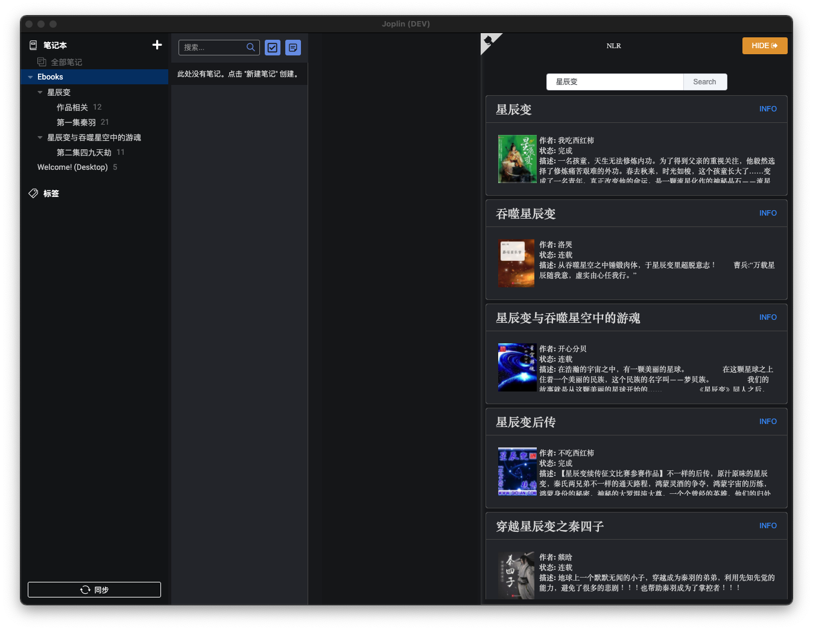

# 名称： 网文下载模块

# 安装： `npm i ebook-getter`

# 使用：

```nodejs
const ebook = require('ebook-getter').default
// es6
// import ebook from 'ebook-getter'


// 根据书名搜索书籍
ebook.houzi.search('斗破苍穹') -> return Promise
// 获取书籍描述等信息
ebook.houzi.desc(bookID) -> return Promise
// 获取书籍章节信息
ebook.houzi.catalog(bookID) -> return Promise
// 获取书籍文本
ebook.houzi.chapter(bookID, chapterID) -> return Promise
// 获取封面图片
ebook.houzi.img(imgName) -> return Promise
```
如下是使用此接口制作的一款joplin的网文阅读器插件：

仓库地址是: [joplin_plugin_nlr](https://github.com/fengqiaozhu/joplin_plugin_nlr)
<br>
<br>
 Joplin是一款开源的笔记工具，
支持多种数据存储空间接入(onedrive, dropbox, nextcloud,webDAV等)，并支持多种笔记数据导入，如印象笔记等，并且此笔记工具的开源社区非常活跃，
是一款非常值得推荐的一款工具。
